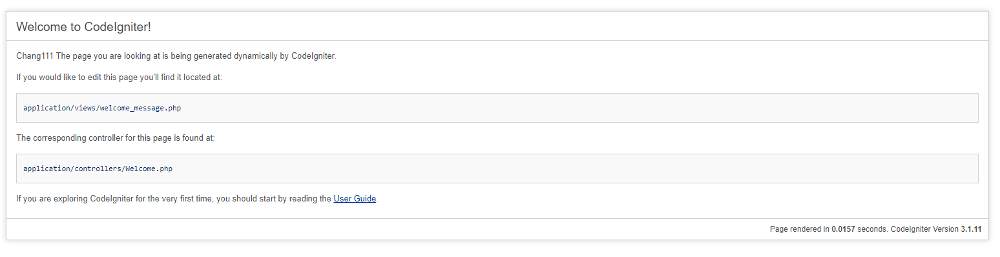

## PHP codelgniter framework
new empty project for codelgiter

## 專案資料夾與檔案格式說明
檔案可按照需求做修改，`postman_collection_local.json`是要快速部屬時進行Postman collection測試的的檔案

| 型態 | 名稱 | 說明 | 路徑 |
| --- | --- | --- | --- |
| 資料夾 | app | 專案主要程式碼 | 根目錄 |
| 檔案 | Dockerfile.local | (可調整)本地端部屬使用 | 根目錄 |
| 檔案 | docker-compose.yaml | (可調整)本地端快速部屬使用 | 根目錄 |
| 資料夾 | iiidevops | :warning: devops系統測試所需檔案 | 在根目錄 |
| 檔案 | .rancher-pipeline.yml | :warning: (不可更動)devops系統測試所需檔案 | 在根目錄 |
| 檔案 | pipeline_settings.json | :warning: (不可更動)devops系統測試所需檔案 | 在iiidevops資料夾內 |
| 檔案 | postman_collection.json | (可調整)devops newman部屬測試檔案 | iiidevops/postman資料夾內 |
| 檔案 | postman_environment.json | (可調整)devops newman部屬測試檔案 | iiidevops/postman資料夾內 |
| 檔案 | Dockerfile | (可調整)devops k8s環境部屬檔案 | 根目錄 |

## iiidevops
* 專案內`.rancher-pipeline.yml`請勿更動，產品系統設計上不支援pipeline修改
* 目前系統pipeline限制，因此寫的服務請一定要在port:`8000`，資料庫類型無法更改。
* `iiidevops`資料夾內`pipeline_settings.json`請勿更動
* `postman`資料夾內則是您在devops管理網頁上的Postman-collection(newman)自動測試檔案，devops系統會以`postman`資料夾內檔案做自動測試
* `Dockerfile`內可能會看到很多本地端`Dockerfile.local`都加上前墜dockerhub，此為必須需求，為使image能從harbor上擷取出Docker Hub的image來源

qq